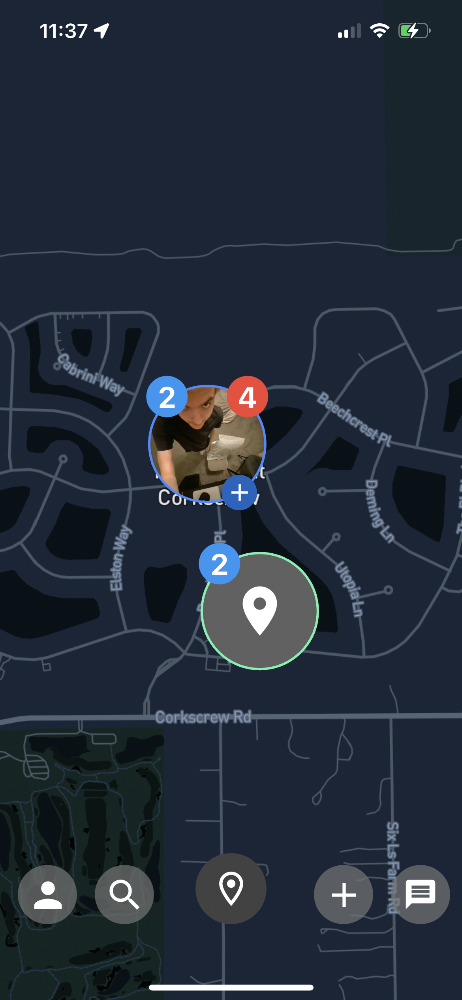

# next-door
Geo-location base social network mobile application


<p align="center">
  
  
</p>

## Set Up

node js plugins
```

npm install aws-sdk bcrypt body-parser dotenv express moment multer multer-s3 mysql nodemon socket.io

```

flutter plugins
```

flutter pub get

```

create .env file and input network IP 
.env:
```

IP = "localhost:3000"

```

run server: `node index.js`